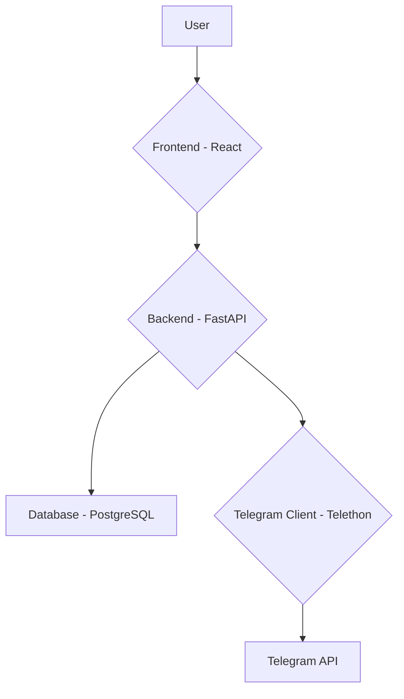

# Architecture

This document provides a high-level overview of the system architecture for the tgForwarder-2026 application.

## System Components

The application is designed with a modern, decoupled architecture, consisting of three main components:

1.  **Frontend**: A React-based single-page application (SPA) for user interaction.
2.  **Backend**: A Python-based API built with FastAPI.
3.  **Telegram Client**: A service that interacts with the Telegram API using Telethon.

## Technology Stack

-   **Frontend**: React, Vite, TanStack Table, Tailwind CSS
-   **Backend**: Python, FastAPI, SQLAlchemy, Uvicorn
-   **Database**: PostgreSQL
-   **Telegram Client**: Telethon
-   **Deployment & Development**: Docker, Docker Compose
-   **CI/CD**: Docker-based pipeline (e.g., GitHub Actions)

## Data Flow

1.  **User Interaction**: The user interacts with the React frontend to manage forwarding rules and view logs.
2.  **API Communication**: The frontend communicates with the FastAPI backend via a RESTful API.
3.  **Data Persistence**: The backend stores and retrieves data (rules, logs, etc.) from the PostgreSQL database.
4.  **Telegram Integration**: The backend communicates with the Telegram Client service to manage the Telegram connection and process messages.
5.  **Message Processing**: The Telegram Client monitors chats, and when a new message arrives, it is sent to the backend for processing by the Rule Engine.
6.  **Forwarding**: If a message matches a rule, the Telegram Client forwards it to the specified destination.

## Key Design Considerations

-   **Scalability**: The decoupled architecture allows for independent scaling of the frontend, backend, and Telegram client.
-   **Security**: User authentication will be implemented to protect the frontend dashboard and API endpoints.
-   **Modularity**: The Rule Engine is designed as a modular component, making it easy to extend with new conditions and transformations.
-   **Reliability**: The use of a robust database like PostgreSQL ensures data integrity and reliability.
-   **Containerization**: All components are Dockerized to ensure consistency across development, testing, and production environments.
-   **CI/CD**: Automated testing and deployment pipelines running in Docker containers to ensure code quality and seamless delivery.
