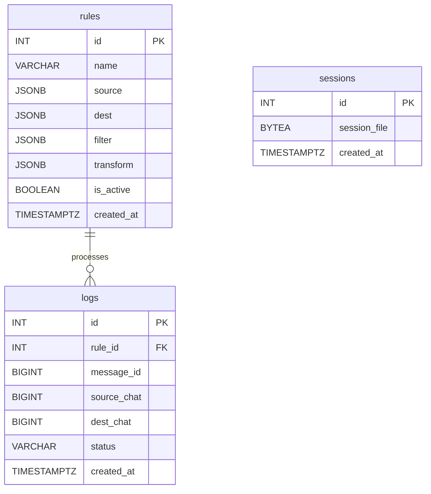

# Database Schema

This document outlines the database schema for the tgForwarder-2026 application.

## Tables

### 1. `rules`

Stores the forwarding rules created by the user.

| Column      | Data Type | Constraints      | Description                               |
| :---------- | :-------- | :--------------- | :---------------------------------------- |
| `id`        | `SERIAL`  | `PRIMARY KEY`    | Unique identifier for the rule.           |
| `name`      | `VARCHAR` | `NOT NULL`       | A descriptive name for the rule.          |
| `source`    | `JSONB`   | `NOT NULL`       | JSON object defining the source chats.    |
| `dest`      | `JSONB`   | `NOT NULL`       | JSON object defining the destination chats|
| `filter`    | `JSONB`   |                  | JSON object for the filtering conditions. |
| `transform` | `JSONB`   |                  | JSON object for message transformations.|
| `is_active` | `BOOLEAN` | `DEFAULT TRUE`   | Whether the rule is currently active.     |
| `created_at`| `TIMESTAMPTZ`|`DEFAULT NOW()` | Timestamp of when the rule was created.   |

### 2. `logs`

Stores logs of all processed and forwarded messages.

| Column         | Data Type     | Constraints   | Description                                         |
| :------------- | :------------ | :------------ | :-------------------------------------------------- |
| `id`           | `SERIAL`      | `PRIMARY KEY` | Unique identifier for the log entry.                |
| `rule_id`      | `INTEGER`     | `FOREIGN KEY` | The ID of the rule that processed the message.      |
| `message_id`   | `BIGINT`      | `NOT NULL`    | The ID of the original Telegram message.            |
| `source_chat`  | `BIGINT`      | `NOT NULL`    | The ID of the source chat.                          |
| `dest_chat`    | `BIGINT`      | `NOT NULL`    | The ID of the destination chat.                     |
| `status`       | `VARCHAR`     |               | The status of the forwarding (e.g., success, fail). |
| `created_at`   | `TIMESTAMPTZ` | `DEFAULT NOW()`| Timestamp of when the message was processed.        |

### 3. `sessions`

Stores session information for the Telegram client.

| Column       | Data Type     | Constraints   | Description                                |
| :----------- | :------------ | :------------ | :----------------------------------------- |
| `id`         | `SERIAL`      | `PRIMARY KEY` | Unique identifier for the session.         |
| `session_file`|`BYTEA`      | `NOT NULL`    | The Telethon session file.                 |
| `created_at` | `TIMESTAMPTZ` | `DEFAULT NOW()`| Timestamp of when the session was created. |

## Entity-Relationship Diagram

